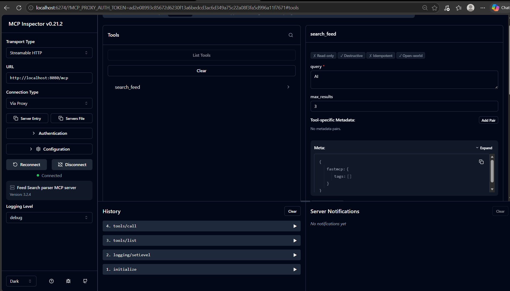
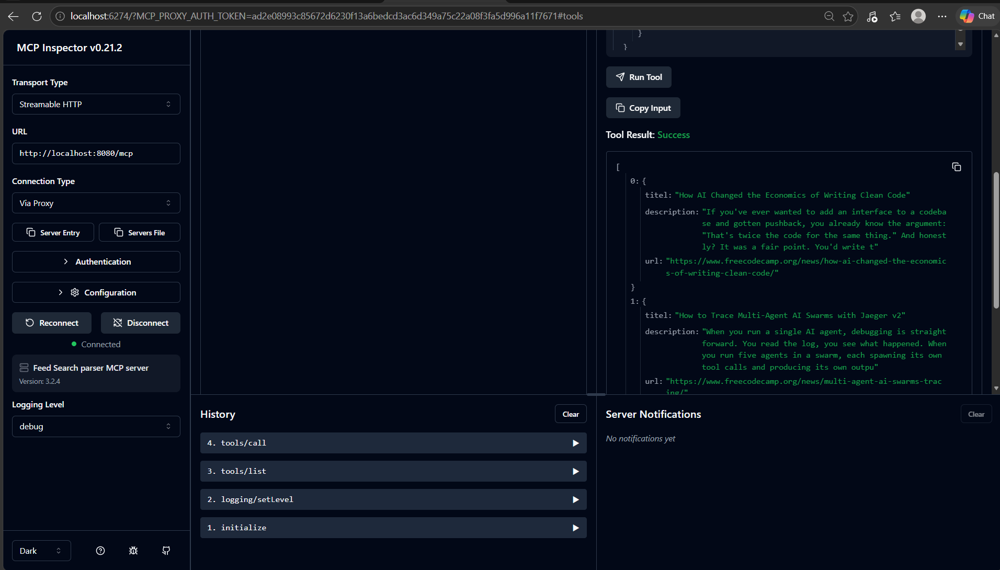
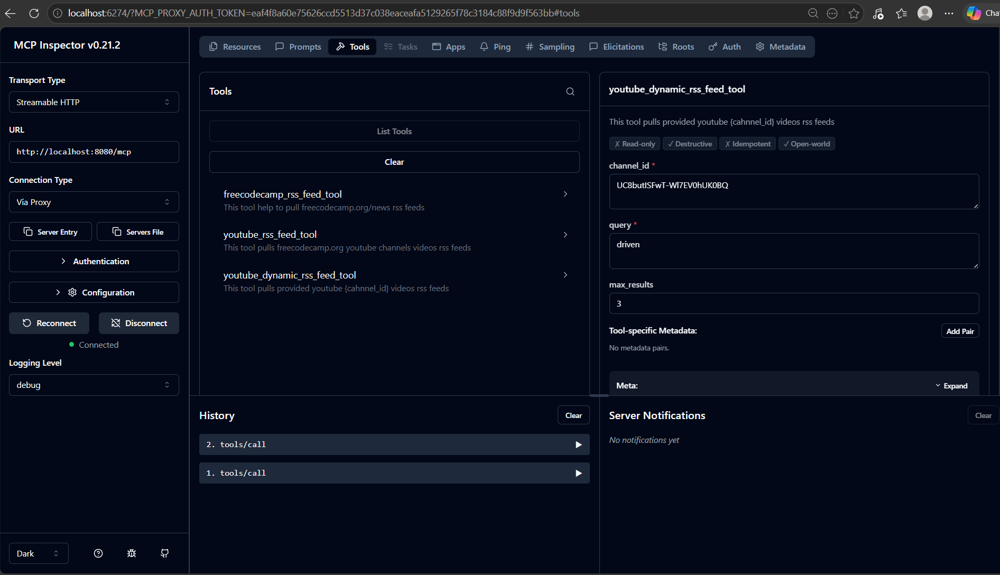
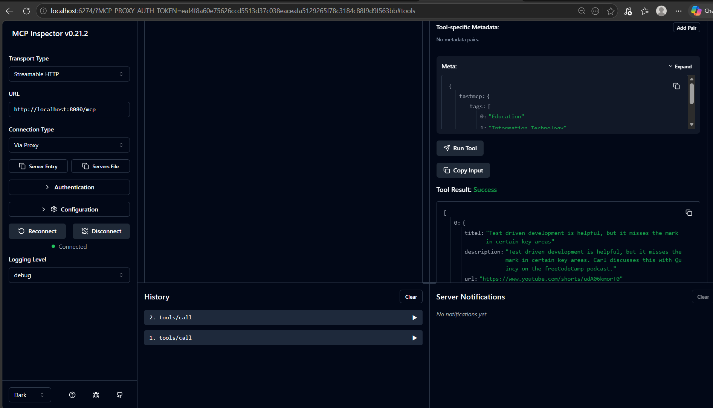

# mcp-server-practice
This repo contains examples of MCP server and its usage and integration with tool and how it can tested.

### STDIO Calculator MCP Server

#### Dependencies:
1. Pyhon
2. uv - package manager to install deps.
2. Node - for npx
4. ollama - Install any model

How to run:
`npx @modelcontextprotocol/inspector python main.py`

### Fast API
#### Dependencies
`uv add fastapi fastapi-mcp uvicorn[standard]`

#### How to run application
`python fastapi-mcp-calculator.py` it will bring up fastapi server on localhost 8080 port number.

##### To access Open API Documentationf of FastAPI use below url.

`http://lcoalhost:8080/docs`

### Converting Fast API server into MCP Server

#### To Convert Fast API server into MCP server import below dependency
`from fastapi-mcp import FastApiMCP`

#### To convert fast api app as MCP sever ingest app to FastApiMCP
`mcp = FastApiMCP(app, name="Name of the MCP Server")`

### To run MCP server as Http Server
`mcp.mount_http()`

### To verify use below URL
`http://localhost:8080/mcp`

Response:

> {
    "jsonrpc":"2.0","id":"server-error","error":{"code":-32600,"message":"Not Acceptable: Client must accept text/event-stream"}}

## feed_search_mcp_server.py
This application demonstrates the capability of polling realtime freecodecamp.org/news feeds and look for users entered criteria and returns list of title, description and link.

#### Dependecies
1. Pyhon
2. uv - package manager to install deps.
2. Node - for npx

#### How to run
`uv run main.py`

run inspector to test feed search api MCP server.

`npx @modelcontextprotocol/inspector http://localhost:8080/mcp`

#### Evidences

#### youtube videos rrs feed search capability added

### .vscode/mcp.json
configured in VS Code
Extions -> MCP Servers - Installed -> Start Server

Start your MCP server seperately on 8080 port number

to run you may need to install supporting libs in advance like mcp-remote
execute `npx mcp-remote http://localhost:8080/mcp`

